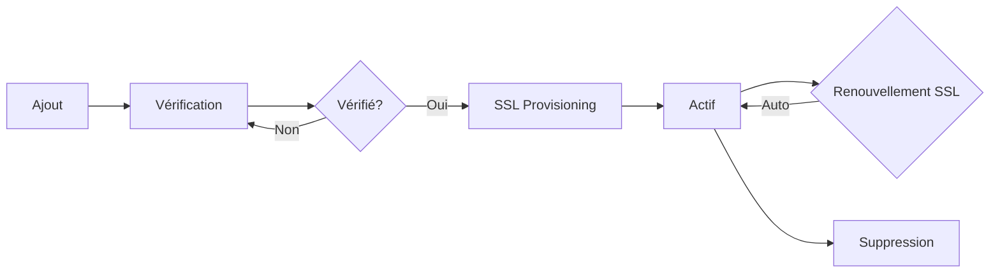

# Guide des Domaines Personnalisés - GMAH Platform

## Vue d'ensemble

La plateforme GMAH permet à chaque organisation d'utiliser son propre nom de domaine personnalisé en plus du sous-domaine par défaut (ex: `paris.gmah.com`). Les organisations peuvent ainsi avoir leur propre identité avec des domaines comme `gmah-paris.org`, `prets-communautaires.fr`, etc.

## 🌐 Types de Domaines Supportés

### 1. Sous-domaine Par Défaut
- **Format**: `{slug}.gmah.com`
- **Exemple**: `paris.gmah.com`
- **SSL**: Automatique (wildcard certificate)
- **Configuration**: Aucune, activé automatiquement

### 2. Domaine Personnalisé
- **Format**: Tout domaine valide
- **Exemples**: 
  - `gmah-paris.org`
  - `prets.synagogue-lyon.fr`
  - `entraide93.com`
- **SSL**: Let's Encrypt automatique après vérification
- **Configuration**: DNS + vérification requise

## 📊 Limites par Plan

| Plan | Domaines Personnalisés | SSL Inclus |
|------|----------------------|------------|
| Starter | 0 | - |
| Community | 1 | ✅ |
| Professional | 3 | ✅ |
| Enterprise | 10 | ✅ |
| Custom | Illimité | ✅ |

## 🚀 Processus d'Ajout d'un Domaine

### Étape 1: Ajouter le Domaine dans l'Interface

```typescript
POST /api/domains/organization/{organizationId}
{
  "domain": "gmah-paris.org",
  "verificationMethod": "DNS_TXT",
  "isPrimary": true
}
```

### Étape 2: Configurer les DNS

#### Option A: Vérification par TXT (Recommandé)
```
Type: TXT
Nom: _gmah-verify.gmah-paris.org
Valeur: gmah-verify-{token}
TTL: 300
```

#### Option B: Vérification par CNAME
```
Type: CNAME
Nom: gmah-paris.org
Valeur: app.gmah.com
TTL: 300
```

### Étape 3: Configuration DNS Complète

Une fois vérifié, configurez ces enregistrements:

```
# Enregistrement A (IPv4)
Type: A
Nom: @
Valeur: 185.199.108.153  # IP du serveur
TTL: 300

# Enregistrement AAAA (IPv6) - Optionnel
Type: AAAA
Nom: @
Valeur: 2606:50c0:8000::153
TTL: 300

# Redirection www
Type: CNAME
Nom: www
Valeur: gmah-paris.org
TTL: 300

# Vérification GMAH
Type: TXT
Nom: _gmah-verify
Valeur: {votre-token}
TTL: 300
```

### Étape 4: Vérifier le Domaine

```typescript
PUT /api/domains/{domainId}/verify
{
  "method": "DNS_TXT"
}
```

### Étape 5: SSL Automatique

Après vérification, un certificat SSL Let's Encrypt est automatiquement généré et renouvelé tous les 90 jours.

## 🔧 API de Gestion des Domaines

### Lister les Domaines
```typescript
GET /api/domains/organization/{organizationId}

Response:
[
  {
    "id": "uuid",
    "domain": "gmah-paris.org",
    "status": "VERIFIED",
    "isPrimary": true,
    "sslStatus": "ACTIVE",
    "sslExpiresAt": "2024-06-01",
    "verifiedAt": "2024-01-01"
  }
]
```

### Ajouter un Domaine
```typescript
POST /api/domains/organization/{organizationId}
{
  "domain": "nouveau-domaine.org",
  "verificationMethod": "DNS_TXT",
  "isPrimary": false
}
```

### Vérifier un Domaine
```typescript
PUT /api/domains/{domainId}/verify
```

### Définir comme Principal
```typescript
PUT /api/domains/{domainId}/primary
```

### Supprimer un Domaine
```typescript
DELETE /api/domains/{domainId}
```

### Obtenir les Instructions DNS
```typescript
GET /api/domains/{domainId}/dns-instructions

Response:
{
  "domain": "gmah-paris.org",
  "method": "DNS_TXT",
  "instructions": {
    "steps": [...],
    "record": {
      "type": "TXT",
      "name": "_gmah-verify.gmah-paris.org",
      "value": "gmah-verify-abc123..."
    }
  },
  "dnsRecords": [...]
}
```

## 🔐 Méthodes de Vérification

### 1. DNS TXT (Recommandé)
- **Avantage**: Ne nécessite pas de changer les DNS existants
- **Délai**: 5-10 minutes
- **TTL recommandé**: 300 secondes

### 2. DNS CNAME
- **Avantage**: Configuration simple
- **Inconvénient**: Remplace les DNS existants
- **Délai**: 5-10 minutes

### 3. Fichier Upload
- **Emplacement**: `/.well-known/gmah-verify.txt`
- **Contenu**: Token de vérification
- **Avantage**: Rapide si accès FTP

### 4. Meta Tag HTML
- **Format**: `<meta name="gmah-verify" content="{token}">`
- **Emplacement**: Dans `<head>` de la page d'accueil
- **Avantage**: Simple pour sites existants

## 🌟 Fonctionnalités Avancées

### Domaine Principal
- Un seul domaine peut être défini comme principal
- Le domaine principal est utilisé dans les emails
- Redirection automatique des autres domaines

### Multi-domaines
- Plusieurs domaines peuvent pointer vers la même organisation
- Utile pour:
  - Différentes langues (gmah-paris.fr, gmah-paris.com)
  - Anciennes URLs
  - Campagnes marketing

### Redirections
```nginx
# Configuration Nginx automatique
server {
  server_name gmah-paris.org www.gmah-paris.org;
  
  # Redirection www → non-www
  if ($host = www.gmah-paris.org) {
    return 301 https://gmah-paris.org$request_uri;
  }
}
```

## 🛠️ Dépannage

### Domaine Non Vérifié

**Problème**: La vérification échoue après configuration DNS

**Solutions**:
1. Attendre 10-15 minutes (propagation DNS)
2. Vérifier avec `nslookup`:
   ```bash
   nslookup -type=TXT _gmah-verify.votre-domaine.org
   ```
3. Vérifier l'exactitude du token
4. Essayer une autre méthode de vérification

### SSL Non Actif

**Problème**: Certificat SSL non généré après vérification

**Solutions**:
1. Vérifier que le domaine pointe vers notre serveur (A record)
2. Attendre 5-10 minutes après vérification
3. Forcer le renouvellement via API

### Domaine Déjà Utilisé

**Problème**: "Domain is already registered"

**Solutions**:
1. Vérifier qu'aucune autre organisation n'utilise ce domaine
2. Contacter le support si c'est votre domaine

## 📋 Checklist de Migration

Pour migrer d'un ancien système:

- [ ] 1. Ajouter le domaine dans GMAH Platform
- [ ] 2. Configurer l'enregistrement TXT de vérification
- [ ] 3. Attendre la vérification (garder l'ancien système actif)
- [ ] 4. Une fois vérifié, mettre à jour les enregistrements A/CNAME
- [ ] 5. Tester avec `curl -I https://votre-domaine.org`
- [ ] 6. Définir comme domaine principal si nécessaire
- [ ] 7. Mettre à jour les emails transactionnels

## 🔍 Commandes de Diagnostic

### Vérifier la Propagation DNS
```bash
# TXT Record
dig TXT _gmah-verify.votre-domaine.org

# A Record
dig A votre-domaine.org

# CNAME
dig CNAME www.votre-domaine.org
```

### Tester le SSL
```bash
# Vérifier le certificat
openssl s_client -connect votre-domaine.org:443 -servername votre-domaine.org

# Test complet
curl -vI https://votre-domaine.org
```

### Vérifier depuis Différents Serveurs DNS
```bash
# Google DNS
dig @8.8.8.8 votre-domaine.org

# Cloudflare DNS
dig @1.1.1.1 votre-domaine.org
```

## 💡 Meilleures Pratiques

1. **TTL Courts lors des Changements**
   - Utiliser TTL 300 (5 min) pendant la migration
   - Augmenter à 3600 (1h) après stabilisation

2. **Domaines de Test**
   - Tester d'abord avec un sous-domaine (test.votre-domaine.org)
   - Valider le processus avant le domaine principal

3. **Monitoring**
   - Configurer des alertes pour expiration SSL
   - Monitorer la disponibilité du domaine
   - Vérifier les logs d'accès

4. **Sécurité**
   - Activer DNSSEC si disponible
   - Configurer CAA records
   - Implémenter HSTS après validation

## 📞 Support

Pour toute assistance avec les domaines personnalisés:

- **Documentation**: https://docs.gmah.com/custom-domains
- **Status Page**: https://status.gmah.com
- **Support Email**: domains@gmah.com
- **Support Prioritaire**: Pour les plans Professional et Enterprise

## 🔄 Cycle de Vie d'un Domaine



## 🎯 Cas d'Usage

### Organisation Multi-Sites
```
Principal: gmah-national.org
├── paris.gmah-national.org
├── lyon.gmah-national.org
└── marseille.gmah-national.org
```

### Marque Blanche
```
Organisation: GMAH Paris
├── gmah-paris.org (Principal)
├── prets-paris.fr (Marketing)
└── aide-communautaire-75.org (Ancien site)
```

### International
```
Organisation: GMAH International
├── gmah.fr (France)
├── gmah.be (Belgique)
├── gmah.ch (Suisse)
└── gmah.ca (Canada)
```