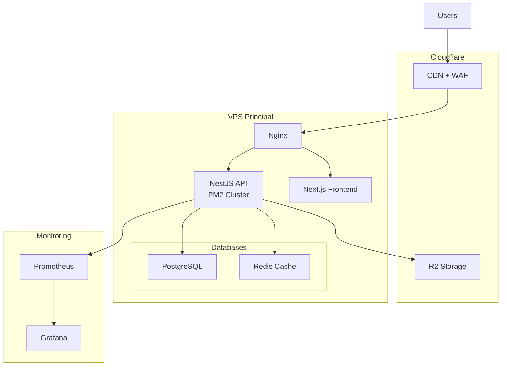

# Architecture Infrastructure GMAH Platform

## Vue d'ensemble

Architecture optimisée pour une plateforme multi-tenant avec isolation par base de données, conçue pour être économique tout en étant scalable.

## Architecture Recommandée

### 1. Stockage des Fichiers - Cloudflare R2
**Pourquoi R2 :**
- **Pas de frais de sortie** (egress gratuit)
- Compatible S3 API
- Tarification : $0.015/GB/mois
- Idéal pour : documents PDF, images, exports, backups

**Utilisation :**
```
├── /tenants/{tenant-id}/
│   ├── /documents/      # Contrats, garanties
│   ├── /uploads/         # Photos, justificatifs
│   ├── /exports/         # Rapports générés
│   └── /backups/         # Sauvegardes tenant
```

### 2. Serveur Principal - VPS Haute Performance

**Option A : Hetzner Cloud (Recommandé)**
- **CPX41** : 8 vCPU, 16GB RAM, 240GB SSD - ~30€/mois
- **CPX51** : 16 vCPU, 32GB RAM, 360GB SSD - ~60€/mois
- Localisation : Europe (Allemagne/Finlande)
- Network : 20TB inclus

**Option B : Contabo VPS**
- **VPS L** : 8 vCPU, 30GB RAM, 800GB SSD - ~20€/mois
- Plus économique mais performances variables

**Services sur le VPS :**
- Backend NestJS (PM2 avec cluster mode)
- Frontend Next.js 
- PostgreSQL (toutes les bases tenant)
- Redis (cache & sessions)
- Nginx (reverse proxy)

### 3. Base de Données - PostgreSQL

**Configuration Multi-Tenant :**
```
/var/lib/postgresql/
├── gmah_master/          # Base principale (organisations)
├── gmah_org_tenant1/      # Base tenant 1
├── gmah_org_tenant2/      # Base tenant 2
└── ...
```

**Optimisations :**
- Connection pooling avec PgBouncer
- Partitioning pour les grandes tables
- Backup automatique quotidien vers R2

### 4. CDN & Protection - Cloudflare

**Services utilisés :**
- **CDN** : Cache des assets statiques
- **WAF** : Protection contre attaques
- **DDoS Protection** : Inclus gratuitement
- **SSL** : Certificats gratuits
- **DNS** : Gestion des sous-domaines

**Configuration :**
```
*.gmah.com → VPS IP
custom-domain.com → CNAME gmah.com
```

## Architecture Détaillée



## Évolution et Scaling

### Phase 1 : Démarrage (0-10 organisations)
- 1 VPS CPX41 (8 vCPU, 16GB RAM)
- PostgreSQL sur le même serveur
- R2 pour stockage
- Coût : ~35€/mois

### Phase 2 : Croissance (10-50 organisations)
- 1 VPS CPX51 (16 vCPU, 32GB RAM)
- PostgreSQL optimisé avec PgBouncer
- Redis Cluster
- Coût : ~65€/mois

### Phase 3 : Scale (50+ organisations)
- 2 VPS : 1 App + 1 DB
- PostgreSQL dédié (managed)
- Load Balancer
- Coût : ~150€/mois

## Sécurité

### Isolation des données
- Une base PostgreSQL par tenant
- Connexions DB isolées
- Pas de requêtes cross-tenant

### Backups
- **Quotidien** : Dump PostgreSQL vers R2
- **Hebdomadaire** : Snapshot VPS complet
- **Mensuel** : Archive longue durée

### Monitoring
- **Uptime** : UptimeRobot ou Pingdom
- **Metrics** : Prometheus + Grafana
- **Logs** : Loki ou Papertrail
- **Alertes** : Email + Slack

## Déploiement

### Stack technique
```yaml
Services:
  - nginx: 1.24+
  - nodejs: 20 LTS
  - postgresql: 15+
  - redis: 7+
  - pm2: latest
  
Outils:
  - docker: optionnel
  - git: déploiement
  - certbot: SSL
  - fail2ban: sécurité
```

### Processus CI/CD
1. **GitHub Actions** : Build & Tests
2. **SSH Deploy** : Push vers VPS
3. **PM2** : Zero-downtime reload
4. **Migrations** : Automatiques par tenant

## Coûts Estimés

### Petite instance (< 10 organisations)
- VPS Hetzner CPX41: 30€/mois
- R2 Storage (100GB): 1.50€/mois
- Cloudflare: Gratuit
- Domaine: 10€/an
- **Total: ~32€/mois**

### Instance moyenne (10-50 organisations)
- VPS Hetzner CPX51: 60€/mois
- R2 Storage (500GB): 7.50€/mois
- Cloudflare Pro: 20€/mois
- Monitoring: 10€/mois
- **Total: ~98€/mois**

### Grande instance (50+ organisations)
- 2x VPS: 120€/mois
- R2 Storage (2TB): 30€/mois
- Cloudflare Business: 200€/mois
- PostgreSQL Managed: 50€/mois
- **Total: ~400€/mois**

## Alternatives Considérées

### Pourquoi pas AWS/GCP/Azure ?
- Coûts egress élevés
- Complexité pour multi-tenant
- Overkill pour ce use case

### Pourquoi pas Vercel/Netlify ?
- Limitations sur les bases de données
- Pas adapté pour multi-tenant avec DB isolation
- Coûts imprévisibles avec scale

### Pourquoi pas Docker/Kubernetes ?
- Complexité additionnelle
- Overhead pour petites instances
- Peut être ajouté plus tard si besoin

## Recommandation Finale

**Pour commencer :**
1. **Hetzner CPX41** pour tout héberger
2. **Cloudflare R2** pour le stockage
3. **Cloudflare** (gratuit) pour CDN/SSL
4. **PostgreSQL** sur le VPS
5. **PM2** pour la gestion des process

Cette architecture permet de :
- Démarrer à ~32€/mois
- Supporter 10-20 organisations facilement
- Scaler progressivement selon les besoins
- Maintenir l'isolation complète des données
- Avoir des performances excellentes
- Simplifier la maintenance