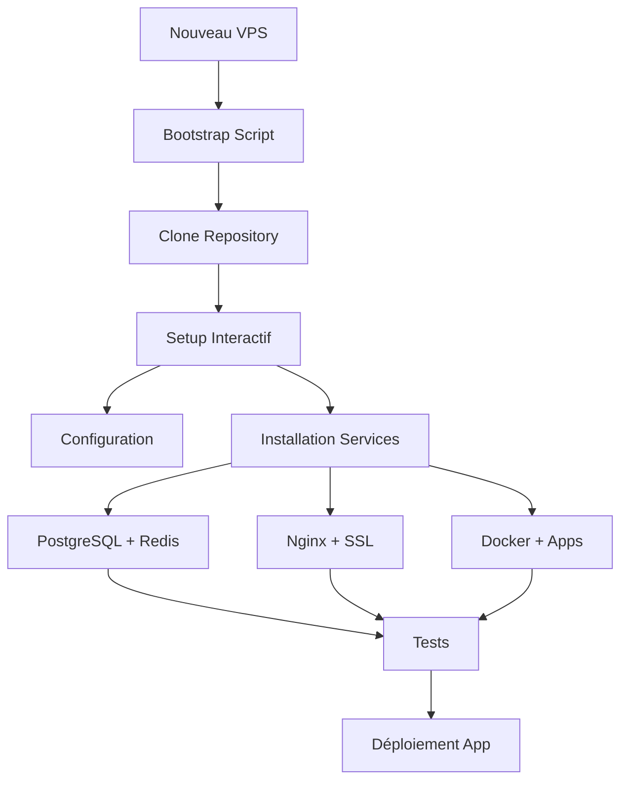

# 🚀 Guide de Déploiement VPS - GMAH Platform

## 📋 Ordre de Déploiement

### Option 1: Bootstrap Automatique (RECOMMANDÉ)

**Une seule commande** pour tout installer :

```bash
# Se connecter au VPS
ssh root@votre-vps-ip

# Télécharger et exécuter le bootstrap
wget https://raw.githubusercontent.com/Eliezelg/gmah/main/scripts/bootstrap-vps.sh
chmod +x bootstrap-vps.sh
sudo ./bootstrap-vps.sh
```

Le bootstrap va :
1. ✅ Installer les dépendances de base (git, curl, etc.)
2. ✅ Cloner automatiquement votre repository
3. ✅ Configurer les permissions
4. ✅ Lancer le script d'installation principal

### Option 2: Installation Manuelle

Si vous préférez contrôler chaque étape :

```bash
# 1. Se connecter au VPS
ssh root@votre-vps-ip

# 2. Installer git
apt-get update && apt-get install -y git

# 3. Cloner le repository
git clone https://github.com/Eliezelg/gmah.git /opt/gmah
cd /opt/gmah

# 4. Lancer les scripts
cd scripts
chmod +x *.sh
sudo ./setup.sh
```

## 🎯 Ordre Recommandé



## ⚡ Installation Rapide

Pour une installation sans interaction :

```bash
# Après le bootstrap
cd /opt/gmah/scripts
sudo ./setup.sh --quick
```

## 🧪 Mode Test

Pour tester d'abord sans modifier le système :

```bash
# Test en mode dry-run
cd /opt/gmah/scripts
sudo ./test-setup.sh --dry-run

# Test dans Docker
sudo ./test-setup.sh --docker
```

## 📝 Configuration Requise

### Avant l'Installation

- **VPS**: Ubuntu 22.04 ou 24.04
- **RAM**: Minimum 4GB (8GB recommandé)
- **Stockage**: Minimum 50GB
- **Accès**: Root ou sudo
- **Ports**: 22, 80, 443 ouverts

### Informations à Préparer

1. **Domaine**: votre-domaine.com
2. **Email Admin**: admin@votre-domaine.com
3. **Repository GitHub**: URL de votre fork
4. **Cloudflare** (optionnel): Token API

## 🔧 Commandes Utiles

### Vérifier l'Installation

```bash
# Voir les logs
tail -f /opt/gmah/logs/setup.log

# Vérifier les services
systemctl status postgresql
systemctl status redis
systemctl status nginx
docker ps

# Tester la configuration
cd /opt/gmah/scripts
./test-setup.sh --all
```

### En Cas de Problème

```bash
# Rollback
cd /opt/gmah/scripts
./setup.sh --rollback

# Réinstaller un composant
./setup.sh --repair postgresql
./setup.sh --repair nginx
```

## 🛡️ Sécurité Post-Installation

Après l'installation :

1. **Changer les mots de passe par défaut**
2. **Configurer les backups automatiques**
3. **Vérifier le firewall**: `ufw status`
4. **Activer fail2ban**: `systemctl enable fail2ban`
5. **Configurer les alertes monitoring**

## 📊 Monitoring

Accès aux interfaces :

- **Grafana**: https://votre-domaine.com:3000
- **Kibana**: https://votre-domaine.com:5601
- **Portainer**: https://votre-domaine.com:9443

## 🔄 Mise à Jour

Pour mettre à jour la plateforme :

```bash
cd /opt/gmah
git pull origin main
cd scripts
./setup.sh --update
```

## ❓ FAQ

**Q: Dois-je d'abord copier le repo sur le VPS?**
> Non, utilisez le script bootstrap qui fait tout automatiquement.

**Q: Puis-je installer sur un VPS existant?**
> Oui, mais faites un backup d'abord. Le script détecte les services existants.

**Q: Comment choisir entre Docker et installation native?**
> Docker est recommandé pour la simplicité. Native pour les performances maximales.

**Q: Que faire si l'installation échoue?**
> Le système de rollback restaure l'état précédent. Consultez les logs dans `/opt/gmah/logs/`.

## 📞 Support

- Logs: `/opt/gmah/logs/setup.log`
- Issues: https://github.com/Eliezelg/gmah/issues
- Documentation: `/opt/gmah/docs/`